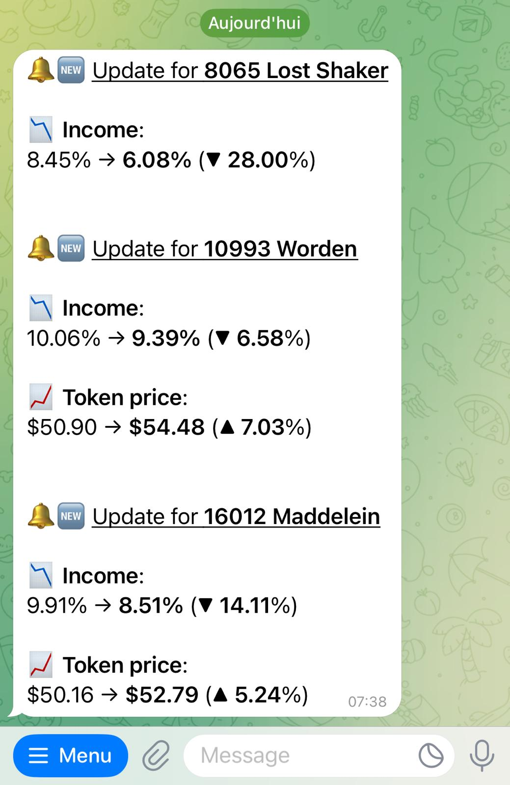
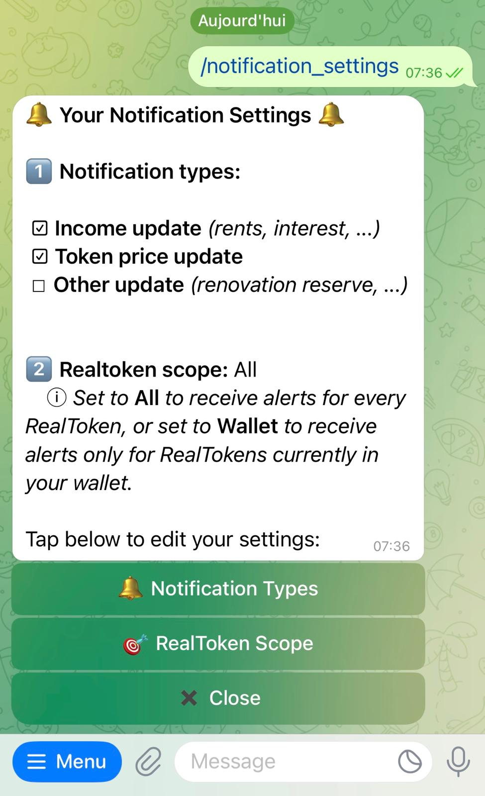

# Realtoken Update Alerts Bot


**Get alerts about your Realtokens.**  
This Telegram bot automatically tracks updates for all **Realtokens** and notifies users whenever there are changes such as:

- Income update (rents, interest, ...)  
- Token price update  
- Other updates (e.g. reserve renovation, underlying asset price, ...)

Users can customize notification types (income, price, other) and choose whether to follow **all Realtokens** or only those in their **wallet**.

<p align="center">
  
  
</p>

---

## Table of Contents

- [Realtoken Update Alerts Bot](#realtoken-update-alerts-bot)
  - [System Requirements](#system-requirements)
  - [Configuration](#configuration)
    - [Configure Environment Variables](#configure-environment-variables)
    - [Configure the bot name and description](#configure-the-bot-name-and-description)
    - [Other configuration](#other-configuration)
  - [Installation & Execution](#installation--execution)
    - [Option A — Docker (Recommended)](#option-a--docker-recommended)
    - [Option B — Manual Installation (Without Docker)](#option-b--manual-installation-without-docker)
  - [Bot core features](#bot-core-features)
  - [Project structure](#project-structure)

  ---

## System Requirements

- Python 3.11+
- Docker & Docker Compose (optional but recommended)

---

## Configuration

### Configure Environment Variables

An example configuration file is provided: `.env.example`.  
Copy it to `.env` and update the values with your own secrets.

```env
BOT_REALTOKENS_UPDATE_ALERTS_TOKEN=
RPC_URLS=https://rpc.ankr.com/gnosis/...,https://gnosis.drpc.org

# Telegram alerts [optional]
TELEGRAM_ALERT_BOT_TOKEN=
TELEGRAM_ALERT_GROUP_ID=
```

> **Note:**  
> RPC URLs must be provided as a comma-separated string on a single line, without spaces.  
> For alerts, you can configure a Telegram bot and a Telegram group: the bot (using `TELEGRAM_ALERT_BOT_TOKEN`) must be added to the telegram chat group (`TELEGRAM_ALERT_GROUP_ID`) to receive automatic notifications about critical events such as failures or application stops.

---

### Configure the bot name and description

To configure the bot’s identity with the BotFather, update the following fields:

**Name**  
>Realtoken Update Alerts bot

**About**  
>Stay informed about the latest RealToken updates (income, token price, and more)

**Description**  
>Get alerts about your Realtokens. This bot automatically tracks updates for all Realtokens and notifies you whenever there are changes such as rental income updates, token price variations, or other important events. Use the menu to customize the type of notifications you want and choose whether to follow all Realtokens or only the ones in your wallet.

**Commands**  
>notification_settings - 🔔 Notification settings  
>setlanguage - 🌐 Set language

**Picture**

Use the image located at `docs/assets/logo.png`

---

### Other configuration

Some default settings of the bot can be customized in the file:

```
.\bot\config\settings.py
```

**Available parameters:**

- `FRENQUENCY_CHECKING_FOR_UPDATES`  
  Interval in minutes between two runs of the **main update cycle**, which checks if there are new updates on RealTokens (income distributions, price changes, etc.): `90`  

- `FRENQUENCY_WALLET_UPDATE`  
  Interval in minutes between two balance refresh operations for **all users’ RealTokens owned**: `2880`  

- `THRESHOLD_BALANCE_DEC`  
  Decimal threshold used to decide whether a RealToken is considered **owned** by a user.  
  If a wallet holds less than this threshold (e.g. dust amounts), the token will **not** be counted as part of the user’s owned RealTokens. The value must be expressed in **decimal format**, not in 256 units.  
       
- `DEFAULT_LANGUAGE`  
  Fallback language used if no user preference is set or if some translastions are missing: `"English"`  

- `REALTOKENS_LIST_URL`  
  Endpoint for fetching the list of Realtokens.  

- `REALTOKEN_HISTORY_URL`  
  Endpoint for fetching the RealToken history.  


---

## Installation & Execution

### Option A — Docker (Recommended)

The project includes a **ready-to-use Docker integration**.

From the **project root directory** (where `docker-compose.yml` is located), build
(or rebuild) and start the service with:

```bash
docker compose up --build -d
```

This single command:
- Rebuilds the image if the source code changed
- Recreates the existing container without duplication
- Starts the service from a clean state


To stop the service:

```bash
docker compose stop
```

> For detailed information about what is happening inside the Docker container, see the section below.

---

### Option B — Manual Installation (Without Docker)

#### 1. Create and Activate a Python Virtual Environment

```bash
# Optional but recommended: create and activate a virtual environment
python3 -m venv .venv
source .venv/bin/activate
```

#### 2. Install python dependencies

```bash
pip install -r requirements.txt
```

#### 3. Running the Project

```bash
# Start the bot
python3 -m bot.main
```
---

## Bot core features

- **Automatic monitoring** of the RealToken community API *(no API key required)*:  
  - Realtokens list: [https://api.realtoken.community/v1/token](https://api.realtoken.community/v1/token)  
  - Realtoken history: [https://api.realtoken.community/v1/tokenHistory](https://api.realtoken.community/v1/tokenHistory)  

- **Main update cycle**  
  - Runs periodically and checks for **new updates** (income distributions, price changes, etc.). Frequency is configurable in bot settings.    
  - If updates are detected, **notifications are sent** to subscribed users in their preferred language.  

- **User settings panel** via inline keyboards  
  - Select notification types (income, price, other).  
  - Choose notification scope: **all tokens** or **only tokens held in wallet**.   

- **Balances monitoring (Wallet mode)**  
  - Balances are retrieved via **multicall** on each RealToken contract address and on the **RMM V3 wrapper** on the gnosis chain. (Ethereum chain, RMMv2, Levinswap, ... are excluded from the balance)  
  - When a user adds a wallet, the bot **fetches all RealToken balances** in that wallet and the list of RealTokens owned is automatically added to the user profile.    
  - Afterwards, **all users’ balances are periodically refreshed** according to a configurable interval (set in bot settings).  
- **Web3 handler (RPC management)**  
  - Manages all requests to the blockchain.  
  - Includes a **retry system** if a Web3 provider does not respond.  
  - Supports **automatic failover**: if one RPC URL is down, the handler switches to the next available RPC URL in the list.  
- **Internationalization (i18n)**  
  - Multi-language support with per-user language preferences.  

---

## Project structure

```
realtoken-update-alerts-bot/
 ├── .env
 ├── .gitignore
 ├── README.md
 ├── requirements.txt
 │
 ├── bot/
 │   ├── main.py                      # Entry point (bot polling + init jobs)
 │   ├── __init__.py
 │   │
 │   ├── balances/                    # Fetch balances from blockchain
 │   │   ├── get_balances_of_realtokens.py
 │   │   ├── get_balances_of_realtoken_wrapper.py
 │   │   └── __init__.py
 │   │
 │   ├── config/
 │   │   ├── settings.py              # Constants like API endpoints
 │   │   └── __init__.py
 │   │
 │   ├── core/
 │   │   ├── run_update_cycle_and_notify.py  # Orchestrates update cycle + notifications
 │   │   ├── __init__.py
 │   │   └── sub/                     # Core logic split into a sub module
 │   │       ├── build_history_state.py
 │   │       ├── build_lines_messages.py
 │   │       ├── filter_messages.py
 │   │       ├── get_new_updates.py
 │   │       └── __init__.py
 │   │
 │   ├── handlers/                    # Telegram command & callback handlers
 │   │   ├── health.py                 # Health check handler
 │   │   ├── set_language.py           # Inline keyboard for language selection
 │   │   ├── start.py                  # /start command
 │   │   ├── user_notifications_settings.py  # Settings UI for notifications
 │   │   └── __init__.py
 │   │
 │   ├── services/                     # Support services
 │   │   ├── fetch_json.py             # Utility for API requests
 │   │   ├── i18n.py                   # Internationalization
 │   │   ├── logging_config.py         # Logging setup
 │   │   ├── user_manager.py           # Manages users
 │   │   ├── user_preferences.py       # Handles user preferences storage
 │   │   ├── utilities.py              # Helper functions (dict transforms, string checks, etc.)
 │   │   ├── w3_handler.py             # Web3 provider & blockchain helpers
 │   │   └── __init__.py
 │   │
 │   └── task/                         # Scheduled & manual tasks
 │       ├── job.py
 │       ├── trigger_update_realtokens_owned_single_wallet.py
 │       ├── update_realtoken_owned.py
 │       └── __init__.py
 │
 ├── docs/
 │   └── assets/                       # logo and demo screenshot
 │       ├── demo_screenshot1.jpg
 │       ├── demo_screenshot2.jpg
 │       ├── logo.jpg
 │       └── logo_v1.jpg
 │
 ├── logs/
 │   ├── .gitkeep
 │   └── realtoken-update-alerts-bot.log
 │
 ├── ressources/                       # ABIs and static resources
 │   └── abi.json
 │
 ├── translations/
 │   └── translations.json             # i18n translations
 │
 └── user_configurations/
     ├── .gitkeep
     └── user_configurations.json      # Saved user settings

```